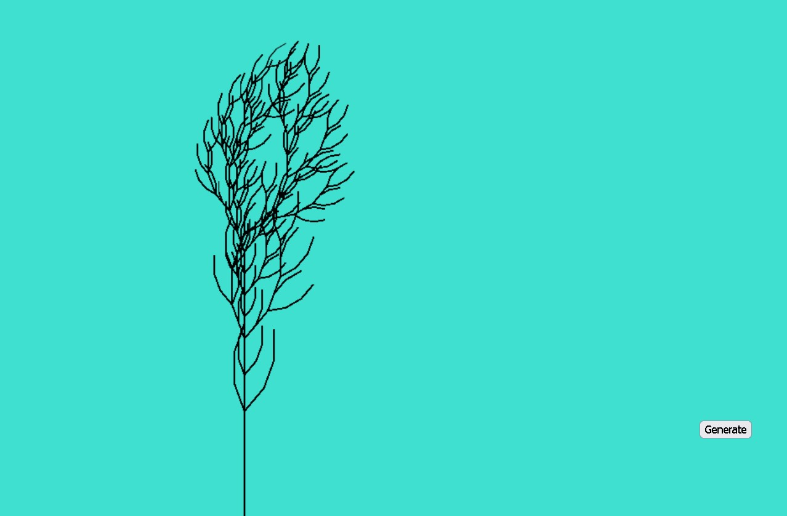

# Prototype 1

For my second assignment I wanted to explore recursion by using fractals and create a coral/ocean inspired design. I decided to use vanilla javascript since I wanted to challenge myself, I wanted to be able to write code and understand how the p5 functions worked in the background. I also thought that if I wanted to use canvas more often, I'd want to learn more about it so I could have more freedom in coding. 

To start, I watched some Coding Train videos on how to apply recursion and made a fractal tree in Javascript. Unfortunantly the videos that I followed were written for the P5 library and I was using vanilla Javascript. I struggled to translate what I saw exactly since I didn't know what was happening in the background of many of the P5 functions. I found that Pop() and Push() in p5 were different in Javascript and I had to use Save() and Revert() but they didn't do the same things. I didn't know how alot of the translations done in P5 worked exactly. So when I make the fractal tree, I couldn't seem to adjust the angles in real time, and my custom draw function crashed the browser when I told it to draw the fractal tree every frame, even though the Coding Train had their code in their draw function which was running every frame. I understood what the ideas they were communicating were and I understood the power of being able to use recursion to draw objects automatically. The process is relatively simple but the results are complicated and visually pleasing and I was thinking of all the was I could use it to make my design.

<iframe width="853" height="480" src="https://www.youtube.com/embed/0jjeOYMjmDU" title="Coding Challenge #14: Fractal Trees - Recursive" frameborder="0" allow="accelerometer; autoplay; clipboard-write; encrypted-media; gyroscope; picture-in-picture; web-share" allowfullscreen></iframe>

[My Fractal Tree Sketch](https://toveys-net-art-s6472m6ack0g.deno.dev/)

I then watched some more Coding Train videos since even though they were for P5 the ideas were still really useful. I wanted to learn more about different fractals, to give me some more options when I create my net art. The L-System video was quite interesting, using text to give the computer drawing commands while also replacing letters of the text with a new variation for the next iteration. There could potentially be alot of randomness involved, and it seemed that I could make the axioms whatever I want as long as I used the right insctruction letters. The shape of the L-System looked very organic as well so I was thinking about using this process for my net art. However, when I tried to translate the P5 to Javascript it didn't go so smoothly. The code would draw the L-System up to the iteration I wanted, but it couldn't draw the next iteration when I tried to update it with a button. The next iteration would get drawn in the wrong position instead of using the last saved transformation state. I couldn't figure out how to solve this problem and I also had problems with the browser crashing when I put code in my custom draw function. I decided that I would need to watch videos about the canvas API specifically if I wanted to make my fractal design with animation.

<iframe width="853" height="480" src="https://www.youtube.com/embed/E1B4UoSQMFw" title="Coding Challenge #16: L-System Fractal Trees" frameborder="0" allow="accelerometer; autoplay; clipboard-write; encrypted-media; gyroscope; picture-in-picture; web-share" allowfullscreen></iframe>

I never pushed my L-System code to deno since I was a bit dissapointed with it. I could only draw up to the 4th generation without crashing the browser, and my next generation draw button didn't work.

