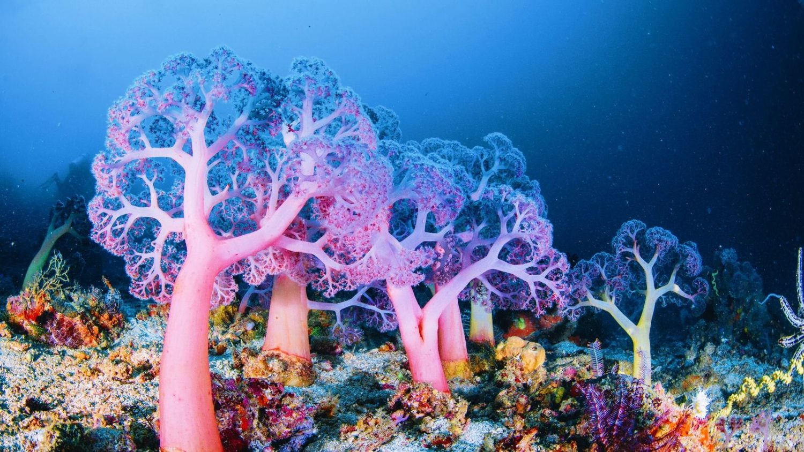

# Fractal Tree No Background

I watched some canvas coding videos from a youtuber called Frank's Laboratory and they had a video about H-Fractals. They made a random fractal generator where the user could use sliders to manipulate the parameters of the fractal. The video essentially used the same techniques as the Coding Train recursion video but also explained how the canvas changes when using the transformation functions. This was very helpful in understanding more about the Canvas API.

<iframe width="853" height="480" src="https://www.youtube.com/embed/dQKYao-daYw" title="Learn Creative Coding: Fractals" frameborder="0" allow="accelerometer; autoplay; clipboard-write; encrypted-media; gyroscope; picture-in-picture; web-share" allowfullscreen></iframe>

I had planned to make my net art ocean/coral themed, and I used some pictures of corals I found online for inspiration. I saw alot of fractals designed to look like trees, but I have always been more interested in the ocean so I wanted to make my fractal look reminiscent of a coral or some oceanic plant.In my code I tweaked the colors and the angle to always generate a fan shape and give the coral a color that would pop against the blue ocean background. The angle made it so the fractal fans out and looks like water is causing it to drift left or right. I decided not to use sliders or buttons for a more immersive design. The video also rotated the fractal around which created a spiral like pattern. I thought this pattern looked really cool, and it gave the fractal more motion. I originally had planned to have multiple coral fractals line up like they were on a rock, and have the background animate as waves, but the spiral gave the fractal alot more complexity and was more interesting to look at.

I also coded it so that the last few generations of the fractal, the tips of it, would be a different color to the stems so that it would look more similar to coral fans and more organic. I also created a new canvas as the background. Since I wanted the fractal patern to have a good degree of complexity, I didn't want to have the canvas it was on animated. If I tried to code a changing background on the same canvas, I'd have to redraw the fractal pattern every frame. So I made a new canvas and using CSS I set it in the background of the fractal canvas, while also making the fractal canvas have a transparent background. The background needed to have some movement since the fractal pattern was pretty static, and I wanted it to feel flowy like the ocean waves. 

https://toveys-net-art-dfba6n1catn0.deno.dev/