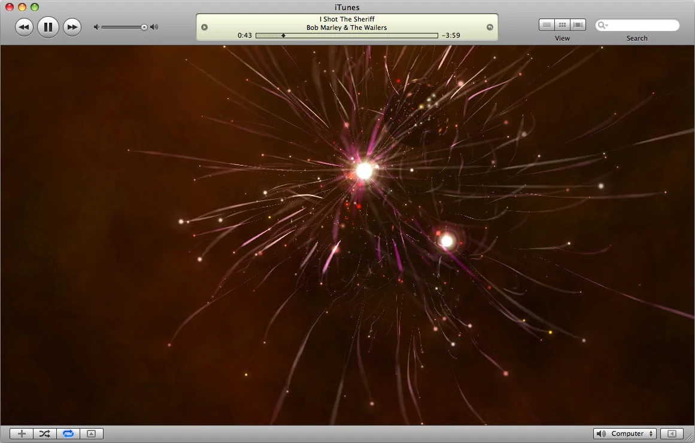
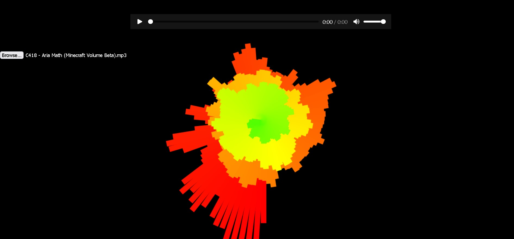
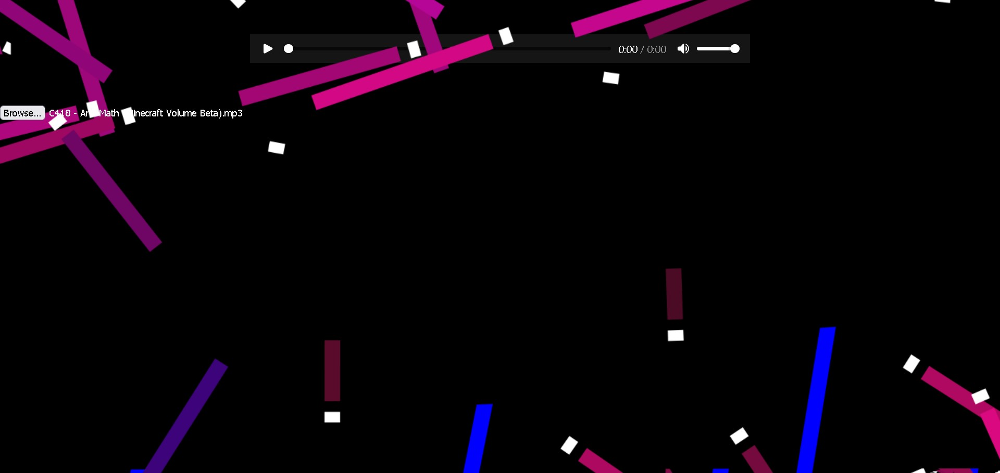

# Experimenting with Web Audio API

For my final assignment I decided that the CoP I would focus on would be my family, more specifically my sister who I share an apartment with.
I came from overseas with my sister and we are renting a relatively small apartment but I personally don't think of the apartment as my home. I think of my apartment as a transitory space until I graduate and get a job, where I would move to something more permanent. I believe that my sister feels the same way. Since this place is temporary we haven't decorated it much and with limited space it is enough of a struggle trying to store the items we brought over. So our apartment does not look or feel very much like a home to us which is why I decided to add some elements of the home we left behind using code. 

We both share similar repertoires, one of which is eating meals together, however since it is just the two of us it can be quite boring. It is missing the rest of our family members to engage with conversation. When we get busy it is all too easy to end up bringing our meals into our own rooms and eating by ourselves while working. I want to strengthen this repertoire by using code to encourage both of us to eat meals together more often. 

This reminded me of when we were younger and we used the desktop computer as our music source (instead of phones and speakers now) which used ITunes as its music library and player. ITunes around 2008 had a music visualizer which fascinated us, every meal my Dad would play some music on the computer and after some time of inactivity, the music visualiser would activate. My siblings and I would finish our meals and as a sort of reward, we could gather around the computer and watch the visuals dance to the music.

This experience incorporates our shared values of music, relaxation, and entertainment. Our shared behaviors now lack some of the values that we once had back at home which is one reason why we may not engage in those behaviors as much.  Using the ITunes audio visualiser as inspiration, I decided to make my own audio visualiser that I could plug into the TV and have on in the background while we eat meals together. We don't use the TV or couch in front of it very much so this would help create a more engaging and lively atmosphere, maybe this will encourage us to use the TV more often. 

To start off I researched Web Audio API which I would use in conjunction with the Canvas API to create visuals that could be affected by audio.
I also used resources on YouTube, a channel called Frank's Laboratory had helped me create fractal based canvas drawings in my previous assignment and I once again used this channel to help me understand some of the Web Audio API features.

<iframe width="853" height="480" src="https://www.youtube.com/embed/VXWvfrmpapI" title="JavaScript Audio CRASH COURSE For Beginners" frameborder="0" allow="accelerometer; autoplay; clipboard-write; encrypted-media; gyroscope; picture-in-picture; web-share" allowfullscreen></iframe>

This video was an excellent place to get started, it was an hour long packed full of information and demonstrations that were a lot easier to understand visually as opposed to reading about them on MDN or Stack Oveflow. Frank's video was very helpful and I was surprised to see that they had less than 100k subscribers so I subscibed since they had helped me many times already. 

Following along I made my first main audio visualiser which I started messing around with. I knew that I wanted a circular audio visualiser to be the center point to my final project with a background that rotates around with some sort of lines. The ITunes audio visualiser had a similar theme, the center had exciting animations and would expand to the edges and fade out in intensity as they travelled. Lines spreading out from the middle was also very common to see. My design needed an exciting vibrant center with animations around the edges in the background in more subdued colors. The center needed to be functional also, I wanted to be able to see the visual representations of frequencies fading in and out as music played. The ITunes audio visualiser reacted to music with complex animations, but it lacked that functionality.

I also experimented with CSS filters to make my main visualiser become sort of liquidy, but this tanked my computer's performance. So while it looked cool, I had to be very careful in my usage of it.

I accidentally messed up my code with the canvas transforms and rotates which caused the creation of an interesting background which I kept in mind for later.
